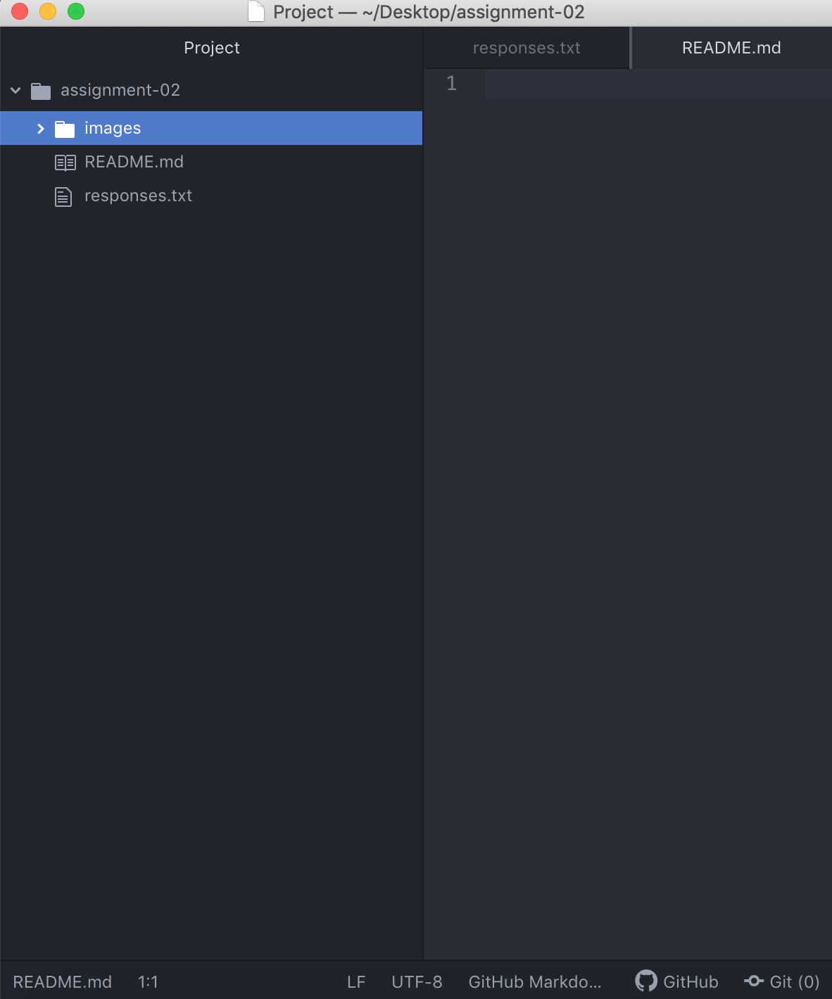

# Assignment 2
## Brian Pinon

I decided to take this class because it is a requirement for my major and I think it would be helpful for me as I study Graphic Design.

Things I've learned:

- The internet is a physical thing and not just a cloud
- Servers talk to each other and request things for their clients
- Text editors help catch mistakes and help you stay more organized

[Pinterest](https://www.pinterest.com/)

[My Responses File](./responses.txt)

