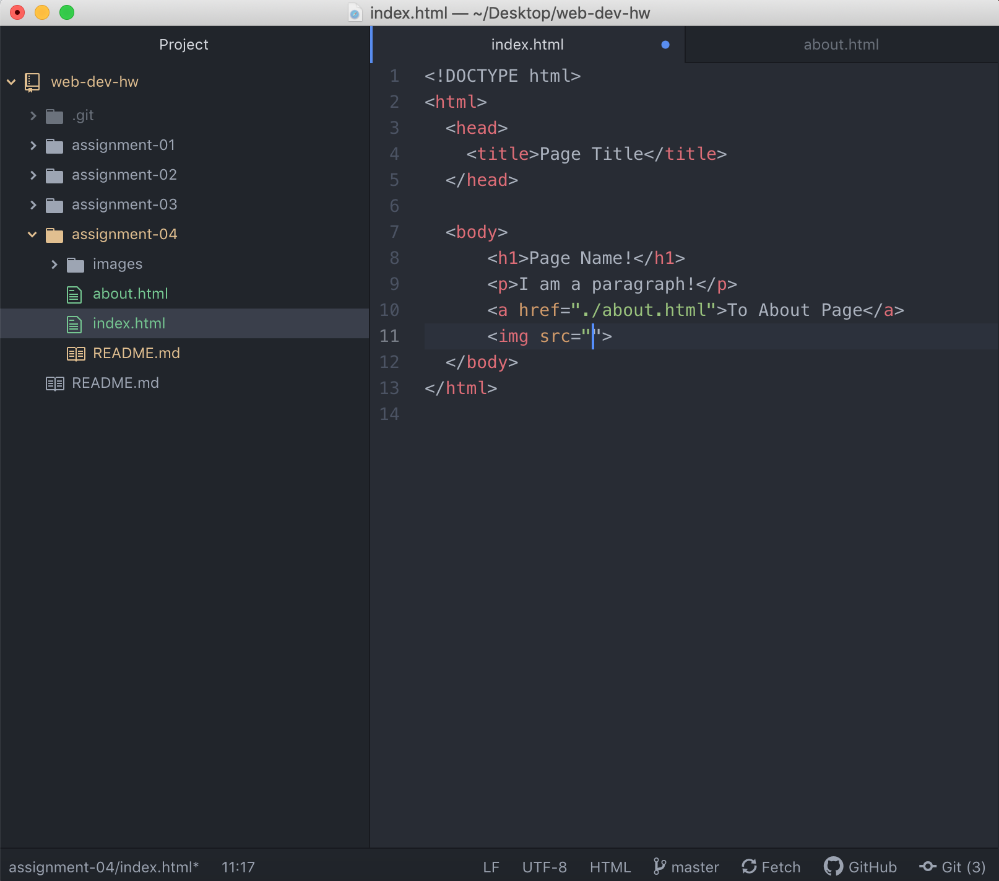

# Assignment 04
## Brian Pinon

1. I went to facebook in 2000 and it has changed a lot. Back then, it was called
"aboutface" and was primarily about learning about people near you in the
workplace or at your university. It wasn't about making friends or staying
connected but was more about finding people to help with your project or
connecting a name to a face. The layout of the cite is very different too and
their tagline was "Never Misplace a Face."

2. Using the GIT Module was fairly straight forward to me. Reading through the
pages and following along with the walkthrough video is very helpful. I like
how any update you make is recorded and that you have to push or publish your
changes in order for it to be active. It is very helpful to also add a
description of the changes you made so you can track updates and changes.

3. 
