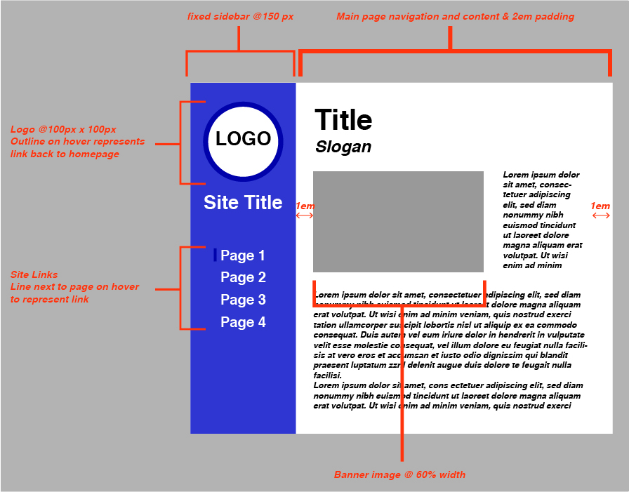

# Assignment 11
## Brian Piñon

1. Padding puts user defined space between different elements which help the website breath. It is like adding spaces or empty pixels in any direction. Borders also create space but in a more visual way. You can add colors to borders and also choose which side it should appear on like padding but borders can have a style and radius. Margins mostly deals with the parent element and adds space between them. It controls the space between boxes at a higher level.

2. 

3. I think this was definitely one of the harder assignments we've done so far. Dealing with centering and alignment and margins and borders is a bit of a headache and little mistakes can be hard to track and fix. I followed along with the walkthrough after many failed attempts at trying on my own, but still made my own touches and changed some things. I love using pseduo-class elements especially adding a hover feature. I am again and again realizing how important organization is and how to do it better which helps me debug or easily find my struggle. Overall, it was fun to make a website that looks more professional and is easy to use!
